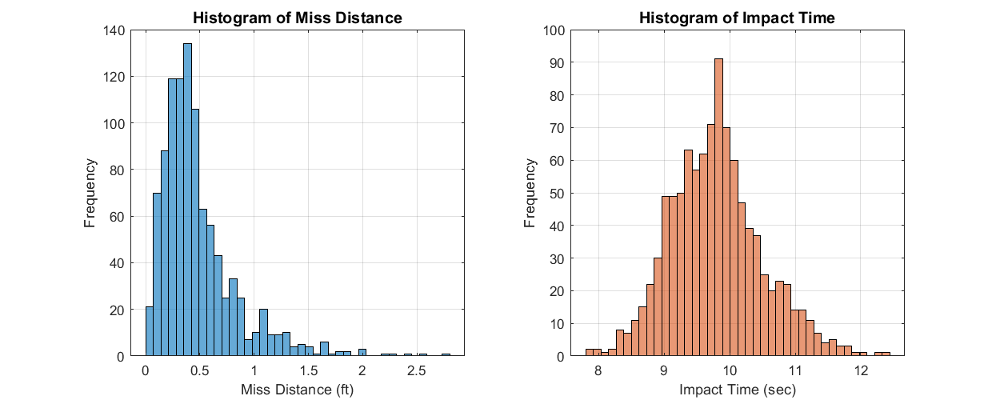
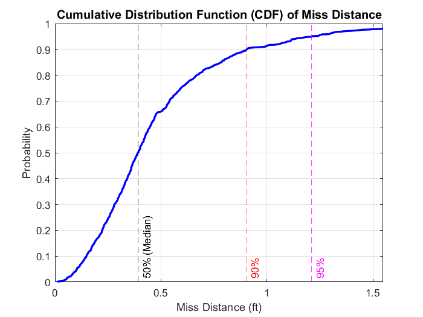
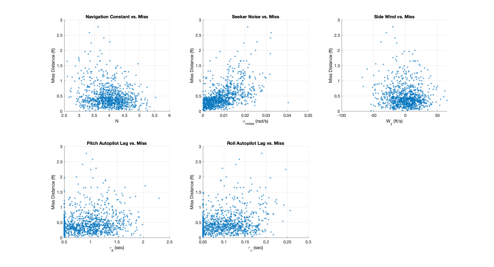

# Bank-to-Turn PNG Guidance Study

An academic MATLAB study of a Lyapunov-based Bank-to-Turn proportional-navigation guidance law using the Nonzero Effort Miss formulation. The project reproduces the principal behavior described by No, Cochran, and Kim and compares the BTT formulation with classical PNG followed by polar conversion.

> **Portfolio note:** This repository documents a university team project. It is maintained by Eden Gadban and highlights her work on the MATLAB implementation, simulation studies, statistical analysis, visualization, and technical reporting. The results apply only to the assumptions and uncertainty ranges of the implemented educational model.

## Project highlights

- Three-dimensional point-mass simulation with first-order seeker and autopilot dynamics
- Nominal comparison of Lyapunov-based BTT PNG and classical PNG with polar conversion
- One-factor-at-a-time sensitivity studies for seeker noise, autopilot lag, and lateral wind drift
- A 1,000-trial Monte Carlo campaign with simultaneous parameter variation
- Live 3D visualization using an altitude-up display while retaining the model's downward-positive internal Z convention
- Explicit discussion of model limitations and higher-fidelity future work

## Selected results

| Metric | Result |
|---|---:|
| Nominal minimum recorded separation | 0.4538 ft |
| Monte Carlo median separation | 0.3928 ft |
| Monte Carlo 90th percentile | 0.9053 ft |
| Monte Carlo 95th percentile | 1.2108 ft |
| Largest observed Monte Carlo separation | 2.7723 ft |
| Mean engagement termination time | 9.79 s |

These are empirical results from the implemented simulation, not performance guarantees outside the modeled conditions.

## Visual results

### Three-dimensional trajectory visualization


### Monte Carlo output distributions



### Empirical miss-distance distribution



### Input-output scatter analysis



## Repository contents

```text
.
├── README.md
├── docs/
│   ├── FUTURE_WORK.md
│   └── IMPLEMENTATION_OVERVIEW.md
└── media/
    ├── btt_live3d_final_frame.png
    ├── BTT_Live3D_Demo.gif
    ├── input_output_scatter.png
    ├── miss_distance_cdf.png
    └── monte_carlo_histograms.png
